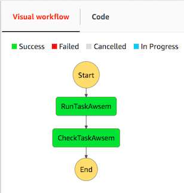
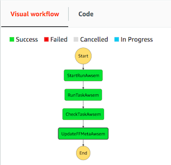

========
Overview
========

Tibanna_ff_ is an extension of Tibanna_ that integrates with 4DN/CGAP data portals. Tibanna is a software tool that helps you run genomic pipelines on the the Amazon (AWS) cloud. Tibanna_ff does the same but in integration with 4DN/CGAP data portal.

The generic Tibanna is called Unicorn, whereas the Tibanna_ff components that are specifically designed for 4DN (4DNucleome), CGAP (Clinical Genome Analysis Platform) and SMaHT are called Pony, Zebra and Tiger respectively.

.. _Tibanna: https://github.com/4dn-dcic/tibanna
.. _Tibanna_ff: https://github.com/4dn-dcic/tibanna_ff

This documentation is written mostly for developers who want to understand the structure of the code arrangements and details of the features and behaviors that are intended for Tibanna Unicorn, Pony and Zebra.

=================  ==============  ===============
 Tibanna Unicorn    Tibanna Pony    Tibanna Zebra and Tiger
=================  ==============  ===============
|tibanna_unicorn|  |tibanna_pony|  |tibanna_zebra|
=================  ==============  ===============

.. |tibanna_pony| image:: images/screenshot_tibanna_pony.png

Tibanna Pony is an extension of Tibanna Unicorn used specifically for 4DN. Pony has two additional steps that communicate with the 4DN Data Portal and handle 4DN metadata. Pony requires access keys to the 4DN Data Portal and the 4DN DCIC AWS account.

Tibanna Zebra and Tiger are extensions of Tibanna Unicorn used specifically for CGAP and SMaHT. Zebra has two additional steps that communicate with the Data Portals and handle the metadata. Zebra requires access keys to the CGAP Data Portal and the CGAP AWS account. Tiger requires access keys to the SMaHT Data Portal and the SMaHT AWS account.

Contents:

.. toctree::
   :hidden:

   self

.. toctree::
   :maxdepth: 4

   news
   code
   installation
   cli
   behavior
   execution_json
   permissions
   tests
   production
